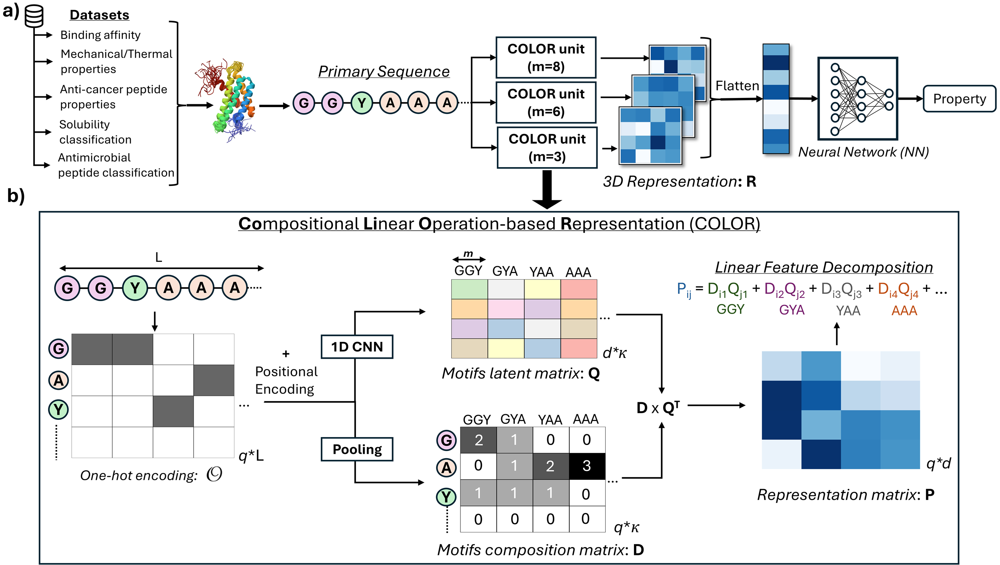

# COLOR
**Paper** <br>
[COLOR: A compositional linear operation-based representation of protein sequences for identification of monomer contributions to properties](https://doi.org/10.1021/acs.jcim.5c00205) <br>

[This paper is also accepted at the ICLR MLGenX workshop:](https://openreview.net/forum?id=4JGIrEGfYz)



<pre> conda env create -f environment.yml </pre>

**Dataset: ACP Aliphatic and GRAVY index**<br>
 - go the respective folder with the dataset name
 - in `./data/`, run `create_data_file.ipynb`
 - Run `train_model.py` to train the model
 - Run `test_model.py` to test the performance of the model
 - Run `monomer_contribution_cal.py` to calculate the contribution score of monomers in the test sequences. 
 - Run `plot_importance.ipynb` to visualize the actual and predicted contribution scores. 


**For all other datasets**<br>
 - go the respective folder with the dataset name
 - in `./data/`, run `create_data_file.ipynb`
 - Run `train_model.py` to train the model
 - Run `test_model.py` to test the performance of the model
 - Run `monomer_contribution_cal.py` to calculate the contribution score of monomers for train, valid, and test dataset separately. 
 - Run `train_masking.py` to unmask sequences in the descending order of the contribution scores.
    - This code will ask for the `% of unmasking` required for the run. 
 - Run `test_masking.py` to test the model with certain % of unmasked monomers. 

## Citation

If you use this work, please cite:

```bibtex
@article{pandey2025color,
  title={COLOR: A compositional linear operation-based representation of protein sequences for identification of monomer contributions to properties},
  author={Pandey, Akash and Chen, Wei and Keten, Sinan},
  journal={Journal of Chemical Information and Modeling},
  year={2025},
  publisher={ACS Publications}
}

